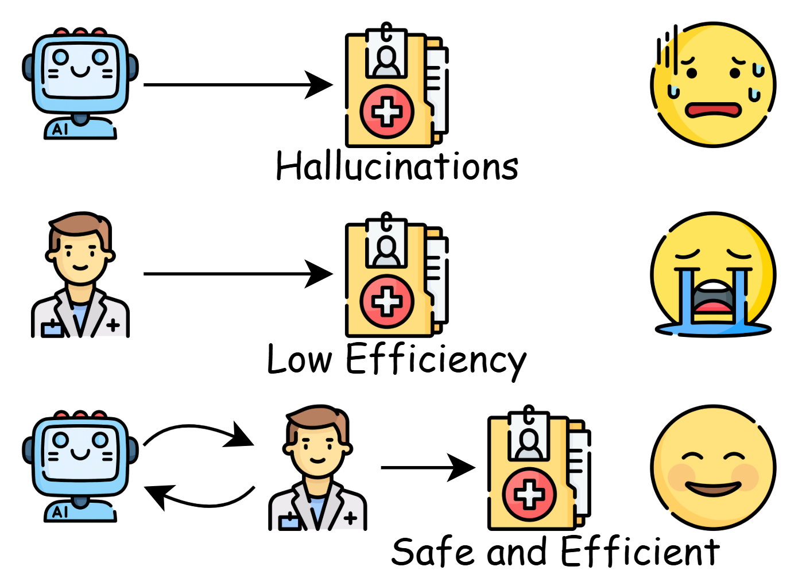
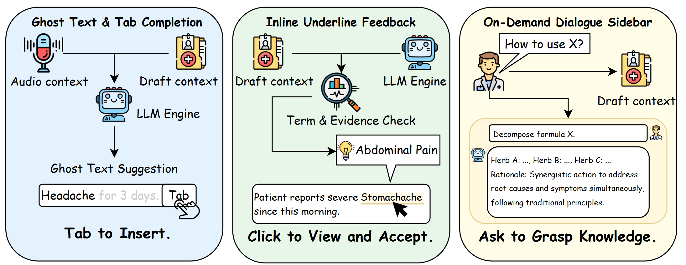

# ClinDoc-Copilot

**Enhancing Efficiency and Clinical Expression Normalization in Chinese Outpatient Settings**

---

## Overview

ClinDoc-Copilot is a research prototype system designed to assist clinicians in generating structured medical records during outpatient consultations. The system integrates real-time speech recognition, large language model (LLM) inference, and rule-based constraints to produce draft clinical documentation that conforms to standard medical record formats.

This project is developed for **research and educational purposes only**. It is not intended for clinical deployment and should not be used for actual patient care.


*Figure 1. Comparison of Different HCI Modes in Chinese Clinical Documentation: (a) Traditional dictation requires post-processing; (b) Form-based input is structured but rigid; (c) ClinDoc-Copilot combines voice input with real-time ghost text suggestions and inline validation.*

### Motivation

Clinical documentation remains a significant burden for healthcare providers. Studies indicate that physicians spend approximately **16 minutes per patient** on EHR-related tasks during outpatient visits, with documentation accounting for a substantial portion of this time.

Existing solutions face key challenges in Chinese clinical settings:

- **Commercial ambient AI systems** (e.g., Nuance DAX, Suki) primarily target English-speaking markets
- **Template-based approaches** lack flexibility for varied clinical presentations  
- **Direct LLM generation** may produce content inconsistent with actual physician-patient dialogue

ClinDoc-Copilot addresses these gaps by providing **real-time, context-aware suggestions** that physicians can accept, modify, or reject—maintaining clinical autonomy while reducing documentation burden.

### Key Contributions

- **Hybrid Input Paradigm**: Combines continuous speech recognition with keyboard-triggered ghost text, allowing seamless switching between voice and manual input
- **Conversation Completeness Detection**: Automatically identifies when sufficient clinical information has been gathered to generate module-specific content
- **Multi-Agent Coordination**: Specialized agents for conversation summarization, terminology normalization, diagnosis validation, and treatment plan generation
- **Inline Compliance Checking**: Real-time validation of generated content against conversation context with Grammarly-style underline markers
- **Modular Architecture**: Separates ASR, LLM inference, and UI concerns for maintainability and extensibility

---

## System Architecture


*Figure 2. Overview of the ClinDoc-Copilot Components.*

---

## Features

| Component | Description |
|-----------|-------------|
| **Speech-to-Text** | Real-time transcription using SenseVoice ASR model via WebSocket streaming |
| **Ghost Text Suggestions** | Inline text completions overlaid on HIS input fields, accept with Tab key |
| **Conversation Completeness Detection** | Automatic detection of when sufficient information is collected per module |
| **Multi-Agent Coordination** | Specialized agents for different documentation aspects (summarization, terminology, diagnosis, treatment) |
| **Terminology Normalization** | Detection and suggestion of standardized medical terms from colloquial expressions |
| **Inline Compliance Checking** | Grammarly-style underline markers for potential inconsistencies with conversation context |
| **RAG Integration** | Retrieval-augmented generation using medical record templates and terminology databases |

### Medical Record Modules

| Module | Input Source | Generation Trigger |
|--------|-------------|-------------------|
| Chief Complaint (主诉) | Voice/keyboard | Symptom + duration pattern detected |
| History of Present Illness (现病史) | Voice + RAG templates | Completeness threshold reached |
| Past Medical History (既往史) | Voice | Gender-aware template matching |
| Physical Examination (体格检查) | Keyboard | Manual trigger |
| Auxiliary Examination (辅助检查) | Keyboard | Manual trigger |
| Diagnosis (诊断) | All modules | ICD-10 code matching + LLM inference |
| Treatment Plan (处置) | Diagnosis + voice | Medication/procedure selection |

---

## Technology Stack

- **Frontend**: Chrome Extension (Manifest V3), vanilla JavaScript
- **Backend**: Python 3.10+, FastAPI, WebSocket
- **ASR**: SenseVoice (FunASR) with streaming support
- **LLM**: OpenAI-compatible API (GPT-4o or equivalent)
- **Vector Database**: ChromaDB for RAG
- **Embedding**: OpenAI text-embedding or local alternatives

---

## Examples

### Ghost Text Workflow

When the clinician speaks: *"患者说头疼三天了，还有点发烧"* (Patient reports headache for three days with fever)

1. **ASR Transcription**: Real-time display of recognized speech
2. **Completeness Detection**: System identifies symptom + duration pattern
3. **Ghost Text Generation**: Suggestion appears in Chief Complaint field:

   ```
   头痛3天，伴发热
   ```

4. **User Interaction**: Press **Tab** to accept, continue typing to dismiss

### Terminology Normalization

| Input (Colloquial) | Suggested (Standard) | ICD-10 Reference |
|--------------------|----------------------|------------------|
| 肚子疼 | 腹痛 | R10.4 |
| 拉肚子 | 腹泻 | K59.1 |
| 心口窝疼 | 胸骨后疼痛 | R07.2 |

### Inline Compliance Markers

When generated content contains information not mentioned in the conversation:

- **Yellow underline**: Terminology suggestion (replaceable)
- **Red underline**: Potential inconsistency (requires review)


*Figure 3. Overview of the ClinDoc-Copilot Workflow.lack text represents content entered by the physician, while gray text indicates suggested completions provided by ClinDoc Copilot. For readers’ convenience, the illustration is in English.*

---

## Evaluation

### Experimental Setup

We conducted preliminary evaluation with synthetic clinical scenarios covering:

- Common outpatient presentations (upper respiratory infections, digestive complaints)
- Various documentation modules (chief complaint, present illness, diagnosis)
- Mixed input modalities (voice-only, keyboard-only, hybrid)

### Metrics

| Metric | Description |
|--------|-------------|
| **Documentation Time** | Time from consultation start to record completion |
| **Edit Distance** | Levenshtein distance between generated and final accepted text |
| **Acceptance Rate** | Percentage of ghost text suggestions accepted without modification |
| **Compliance Score** | Accuracy of generated content against conversation ground truth |

### Limitations of Evaluation

- Conducted with simulated scenarios, not real clinical environments
- Sample size insufficient for statistical significance claims
- Subjective usability assessment not included in current version
- Cross-validation with clinical experts pending

---

## Installation & Usage

### Prerequisites

- Python 3.10+
- Chrome browser
- OpenAI API key (or compatible endpoint)

### Backend Setup

```bash
cd backend

# Create virtual environment
python -m venv venv
source venv/bin/activate  # Windows: venv\Scripts\activate

# Install dependencies
pip install -r requirements.txt

# Configure environment
cp .env.example .env
# Edit .env to add your API key

# Start server
python server.py
```

### Extension Setup

1. Open `chrome://extensions/`
2. Enable "Developer mode"
3. Click "Load unpacked" and select the `extension/` folder
4. Click the extension icon to open the sidepanel

### Verification

Open `backend/test-copilot-full.html` in Chrome to verify the system is functioning correctly.

---

## Data & Compliance Statement

### Data Sources

- All demonstration data in this repository is **synthetic or fully de-identified**
- No real patient data is included or required for system operation
- Medical terminology databases are derived from publicly available standards

### Intended Use

This system is a **research prototype** developed for:

- Academic research in medical informatics and NLP
- Educational demonstrations of LLM applications in healthcare
- Exploration of human-AI collaboration in clinical workflows

### Limitations & Disclaimers

- This system is **NOT** a certified medical device
- It should **NOT** be used for actual clinical decision-making or patient care
- Generated content requires review and validation by qualified healthcare professionals
- The authors make no claims regarding clinical accuracy or safety
- Users are responsible for compliance with applicable regulations in their jurisdiction

### Ethical Considerations

- LLM-generated medical content may contain errors or hallucinations
- The system is designed to assist, not replace, clinical judgment
- Deployment in real clinical settings would require extensive validation and regulatory approval

---

## Citation

If you use this project in your research, please cite:

@inproceedings{clindoc_copilot_2025,
  title = {ClinDoc-Copilot: Enhancing Efficiency and Clinical Expression Normalization in Chinese Outpatient Settings},
  author = {},
  booktitle = {},
  year = {2025},
  publisher = {},
  address = {},
  doi = {}
}


## Related Work

ClinDoc-Copilot builds upon and differentiates from existing clinical documentation systems:

| System | Approach | Key Difference |
|--------|----------|----------------|
| **Nuance DAX** | Ambient AI, post-visit summarization | ClinDoc-Copilot provides real-time suggestions during consultation |
| **Suki** | Voice-driven EHR assistant | ClinDoc-Copilot focuses on Chinese clinical terminology and formats |
| **Dragon Medical** | Dictation + transcription | ClinDoc-Copilot adds ghost text suggestions and compliance checking |
| **GPT-based generators** | Direct LLM generation | ClinDoc-Copilot constrains output to conversation-grounded content |

---

## License

This project is licensed under the [MIT License](LICENSE).

---

## Acknowledgments

- [FunASR](https://github.com/alibaba-damo-academy/FunASR) for the SenseVoice ASR model
- [LangChain](https://github.com/langchain-ai/langchain) for LLM orchestration utilities
- [ChromaDB](https://github.com/chroma-core/chroma) for vector storage

---

**Note**: This is an active research project. APIs and interfaces may change without notice.
